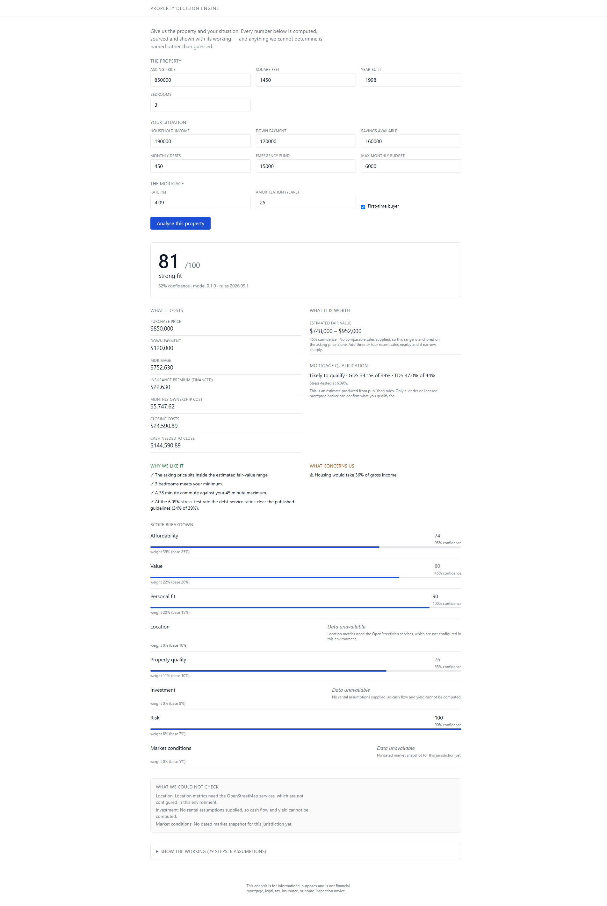

# AI Property Decision Engine

> Give me a property and my situation. I will do the analysis and explain whether this property
> makes sense **for me**.

A property decision engine for Ontario home buyers. It combines a household's finances and
requirements with a property's details, computes the money deterministically, scores the match,
surfaces the risks worth investigating, and explains the result — labelling every number as
verified, calculated, estimated, assumed, AI-inferred, or unavailable.

**Status: end-to-end walking skeleton.** A real analysis runs from a browser form through the
API to the engines and back: Buy Score, money, factors, breakdown, missing-data states and the
full working. Phases A–E are complete; F–K are partial and L has not started — see
[`docs/ROADMAP.md`](docs/ROADMAP.md) for exactly what is and is not built.



**Run it:** two terminals, no database or Docker required.

```bash
cd backend && .venv/Scripts/uvicorn app.main:app --reload --port 8000
cd web     && npm run dev          # then open http://localhost:3000
```

Full setup, tests and the optional local model and OpenStreetMap stack:
[`docs/RUNBOOK.md`](docs/RUNBOOK.md).

---

## What is here

| Document | What it holds |
|---|---|
| [`docs/research/RESEARCH_REPORT.md`](docs/research/RESEARCH_REPORT.md) | The Ontario data ecosystem, mortgage and tax rules with effective dates, competitors, and the risk register |
| [`docs/product/PRODUCT_THESIS.md`](docs/product/PRODUCT_THESIS.md) | Customer, jobs to be done, why existing tools fail, the moat |
| [`docs/architecture/ARCHITECTURE.md`](docs/architecture/ARCHITECTURE.md) | System shape, engines, provider abstractions, data model proposal |
| [`docs/data/DATA_SOURCES.md`](docs/data/DATA_SOURCES.md) | Every candidate source, what it gives us, and in what order to integrate |
| [`docs/data/DATA_LICENSING.md`](docs/data/DATA_LICENSING.md) | The licence gate — no source is integrated without a row here |
| [`docs/DATABASE.md`](docs/DATABASE.md) | Schema, and the six things it refuses to allow |
| [`docs/API.md`](docs/API.md) | REST contract: provenance envelopes, nullable Buy Score, unavailable-as-a-value |
| [`docs/scoring/SCORING_MODEL.md`](docs/scoring/SCORING_MODEL.md) | Buy Score v0.1: components, weights, missing data, confidence, calibration plan |
| [`docs/compliance/COMPLIANCE.md`](docs/compliance/COMPLIANCE.md) | FSRA, TRESA, AI regulation, PIPEDA, and the pre-launch checklist |
| [`docs/decisions/0001-initial-architecture.md`](docs/decisions/0001-initial-architecture.md) | The eight decisions that shape everything after |
| [`docs/decisions/0002-zero-cost-data-strategy.md`](docs/decisions/0002-zero-cost-data-strategy.md) | The $0 stack, and exactly what may and may not be collected automatically |
| [`docs/decisions/0003-toronto-pilot.md`](docs/decisions/0003-toronto-pilot.md) | Toronto as pilot city, and the sources it unlocks |
| [`docs/decisions/0004-ai-judgements.md`](docs/decisions/0004-ai-judgements.md) | How AI improves the decision without touching the arithmetic |
| [`docs/GLOSSARY.md`](docs/GLOSSARY.md) | Every term in plain language, for someone buying their first home |
| [`docs/DEPLOY.md`](docs/DEPLOY.md) | Free hosting, and why a stateless analyze path makes it possible |
| [`docs/RUNBOOK.md`](docs/RUNBOOK.md) | How to run it, test it, and switch on the optional pieces |
| [`docs/ROADMAP.md`](docs/ROADMAP.md) | Phases A–L, the first four weeks, and V1–V10 |

## Principles

1. Trust over hype · 2. Transparency over magic · 3. Data over LLM guessing ·
4. Explainability over black boxes · 5. Ranges over false precision ·
6. Sourced fact over unsourced claim · 7. User-specific over generic ·
8. Deterministic calculation · 9. Missing data stays visible · 10. Every score is explainable.

The AI layer never performs financial arithmetic, never invents a number, and never overrides a
deterministic result. It explains what the engines computed.

## Three facts that shape the whole build

1. **It costs $0 in data licence fees.** The location stack is self-hosted OpenStreetMap
   (Nominatim + OSRM + Overpass) on an Ontario extract, which is both free and — unlike Google —
   licensed to let us store what we compute. Everything else is government open data or supplied
   by the user. See [ADR 0002](docs/decisions/0002-zero-cost-data-strategy.md).
2. **Ontario sold prices are not public.** CREA's DDF is display-only under its own rules; board
   feeds require a licensed brokerage. So comparables come from the user — the person already
   entitled to see them — and analysis confidence rises with how many they supply.
3. **We do not collect from sites that forbid it.** Not a preference: *Century 21 Canada v.
   Rogers Communications*, 2011 BCSC 1196 held browse-wrap terms enforceable, found copyright
   infringement in scraped listings, rejected fair dealing, and granted an injunction. Automated
   collection from open-licensed government and OSM sources is permitted and used heavily.

## Not

Not a listing portal, not a mortgage broker, not an appraisal, not an AVM company, not a chatbot.

---

This analysis is for informational purposes and is not financial, mortgage, legal, tax,
insurance, or home-inspection advice.
